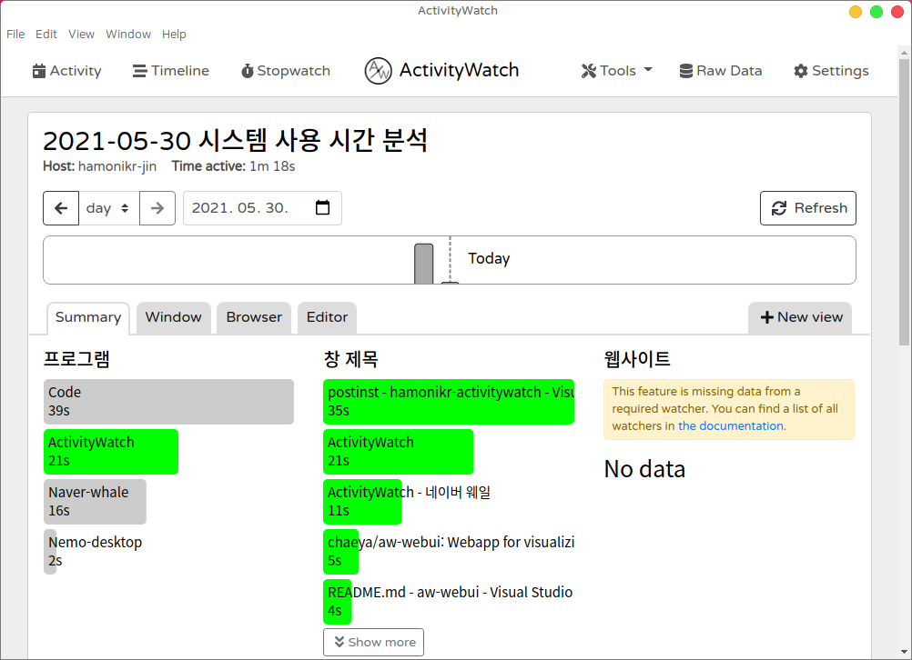
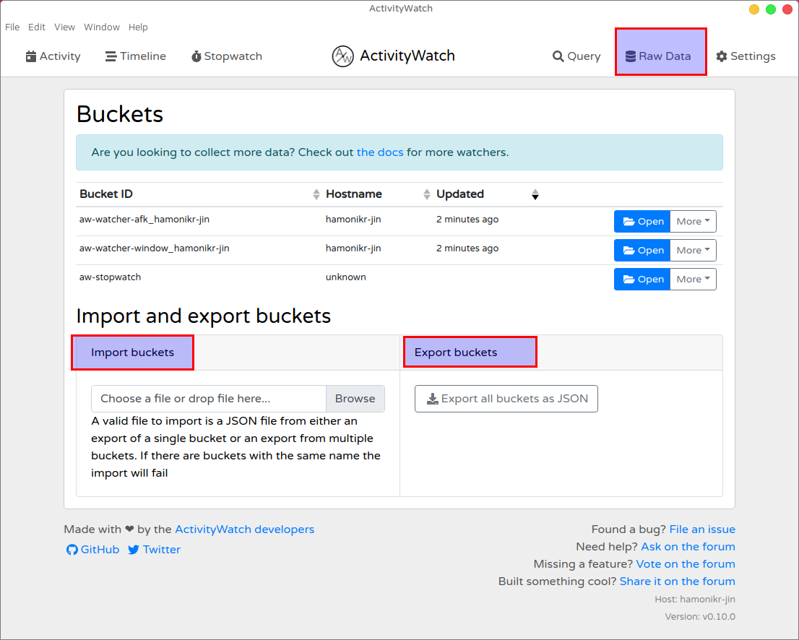

# hamonikr-activitywatch

**시스템 및 프로그램 사용시간 모니터링**

이 프로그램은 시스템 및 프로그램의 사용시간을 모니터링해서 얼마나 많은 시간을 사용하는지 알 수 있게 보여줍니다. (윈도우, 리눅스, 맥 지원)

 * upstream : https://github.com/ActivityWatch/activitywatch



# How To Use

## 하모니카 사용자

```bash
sudo apt install hamonikr-activitywatch
```
프로그램 설치 후 시스템을 재시작하면 자동으로 프로그램이 시작되어 시스템 트레이에 아이콘이 나타납니다.

`프로그램 메뉴 > 보조프로그램 > 시스템 사용시간 보기` 을 실행

## Ubuntu (>=20.04), LinuxMint (>=20.1)

```bash
# Add repository
wget -qO- https://pkg.hamonikr.org/add-hamonikr.apt | sudo -E bash -
# Install
sudo apt install hamonikr-activitywatch
```
## Windows

1) 아래 링크의 파일을 다운로드 후 실행
 https://github.com/hamonikr/hamonikr-activitywatch/releases/download/1.0.0/activitywatch-v0.10.0-windows-x86_64-setup.exe

2) 브라우저에서 url 열기 : http://localhost:5600/

3) 항상 실행될 수 있도록 시작 프로그램에 등록

## Mac

1) 아래 링크의 파일을 다운로드 후 실행
 https://github.com/hamonikr/hamonikr-activitywatch/releases/download/1.0.0/activitywatch-v0.10.0-macos-x86_64.dmg

2) 브라우저에서 url 열기 : http://localhost:5600/

3) 항상 실행될 수 있도록 시작 프로그램에 등록

# 다른 시스템의 데이터를 내보내기 및 가져오기

아래 이미지와 같이 프로그램 상단의 `Raw Data` 메뉴를 이용하여
다른 시스템에서 수집된 데이터를 가져와서 분석할 수 있습니다.
 * `Export buckets` : 수집된 데이터 내보내기
 * `Import buckets` : 수집된 데이터 가져오기



# How to build (HamoniKR 4.0)
Require packages
 * nodejs
 * npm
 * electron , electron-build
```
```
## License

[MPL-2.0](LICENSE.md)
