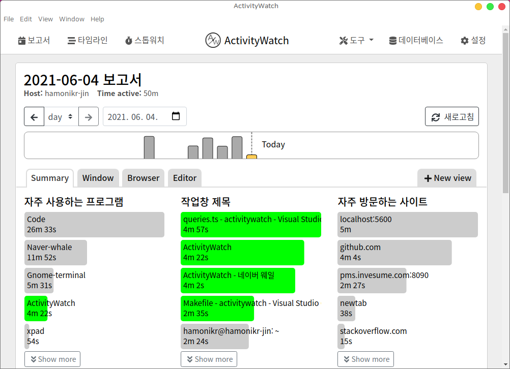
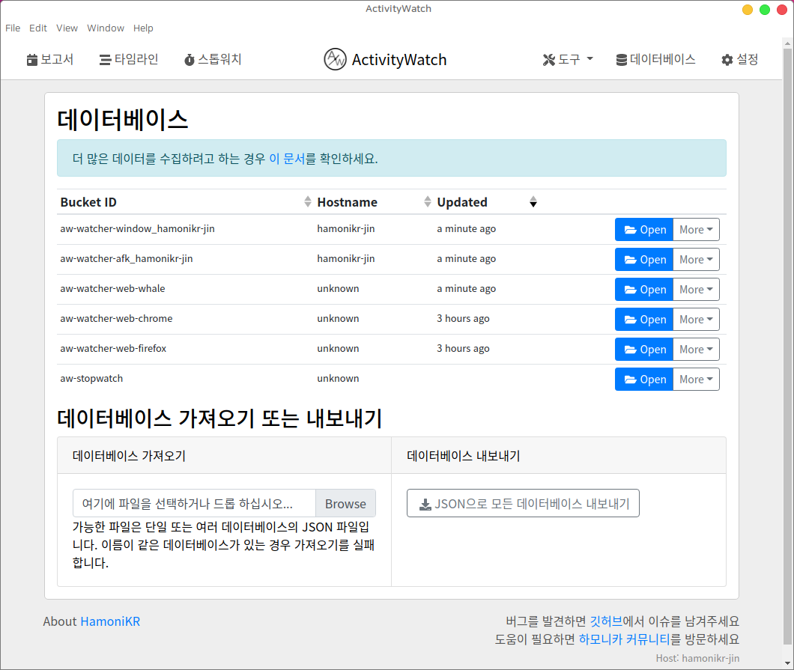

# hamonikr-activitywatch

## 시스템 및 프로그램 사용시간 보고서

이 프로그램은 시스템 및 프로그램의 사용시간을 모니터링해서 얼마나 많은 시간을 사용하는지 알 수 있게 보여줍니다. (윈도우, 리눅스, 맥 지원)

 * upstream : https://github.com/ActivityWatch/activitywatch
 * upstream version : v0.10.0

## 주요 기능
 * 윈도우, 리눅스, 맥 사용자의 시스템 활동 분석 보고서 제공
 * 사용자가 지정한 업무 분류로 구분해서 분석 가능 (개발, 사무, 그래픽 등)
 * 수집 데이터의 내보내기, 가져오기 지원
 * 네이버 웨일 브라우저 활동에 대한 도메인 및 URL 추척 기능 지원
 



# How To Use

## 하모니카 사용자

```bash
sudo apt install hamonikr-activitywatch
```
프로그램 설치 후 시스템을 재시작하면 자동으로 프로그램이 시작되어 시스템 트레이에 아이콘이 나타납니다.

`프로그램 메뉴 > 보조프로그램 > 시스템 사용시간 보기` 를 실행

## Ubuntu (>=18.04), LinuxMint (>=19)

```bash
# Add repository
wget -qO- https://pkg.hamonikr.org/add-hamonikr.apt | sudo -E bash -
# Install
sudo apt install hamonikr-activitywatch
```
## Windows

1) 아래 링크의 파일을 다운로드 후 실행
 https://github.com/hamonikr/hamonikr-activitywatch/releases/download/1.0.0/activitywatch-v0.10.0-windows-x86_64-setup.exe

2) 브라우저에서 url 열기 : http://localhost:5600/

## Mac

1) 아래 링크의 파일을 다운로드 후 실행
 https://github.com/hamonikr/hamonikr-activitywatch/releases/download/1.0.0/activitywatch-v0.10.0-macos-x86_64.dmg

2) 브라우저에서 url 열기 : http://localhost:5600/

3) 항상 실행될 수 있도록 시작 프로그램에 등록

## 웹사이트 분석(URL 추적)을 사용하고 싶은 경우
사용하는 브라우저에 맞는 아래의 확장기능을 추가로 설치해야 합니다.
* Naver Whale, Chrome : https://chrome.google.com/webstore/detail/nglaklhklhcoonedhgnpgddginnjdadi/
* Firefox : https://addons.mozilla.org/en-US/firefox/addon/aw-watcher-web/

## 다른 시스템의 데이터를 내보내기 및 가져오기

아래 이미지와 같이 프로그램 상단의 `데이터베이스` 메뉴를 이용하여
다른 시스템에서 수집된 데이터를 가져와서 분석할 수 있습니다.



# How to build (HamoniKR 4.0)

 * 빌드 문서 참고 : https://github.com/hamonikr/hamonikr-activitywatch/wiki
 * upstream doc : https://docs.activitywatch.net/en/latest/installing-from-source.html
 
## 한글 페이지 수정본은 아래 링크 참고
 * https://github.com/chaeya/aw-webui

## License

[MPL-2.0](LICENSE.md)
